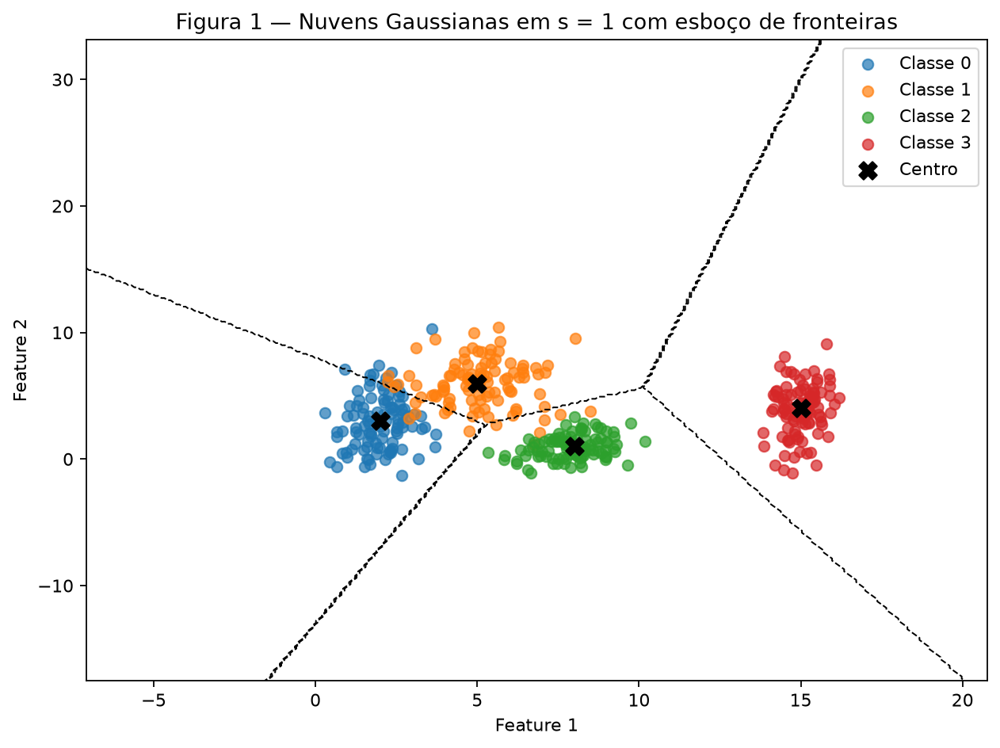
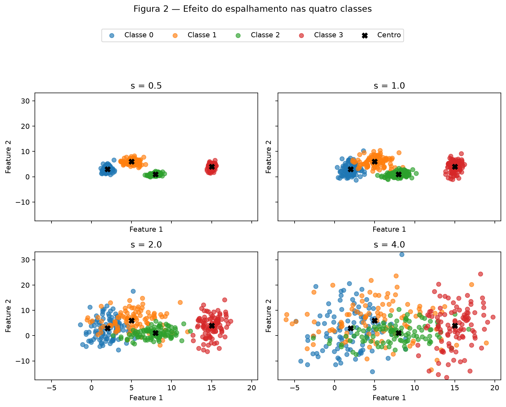
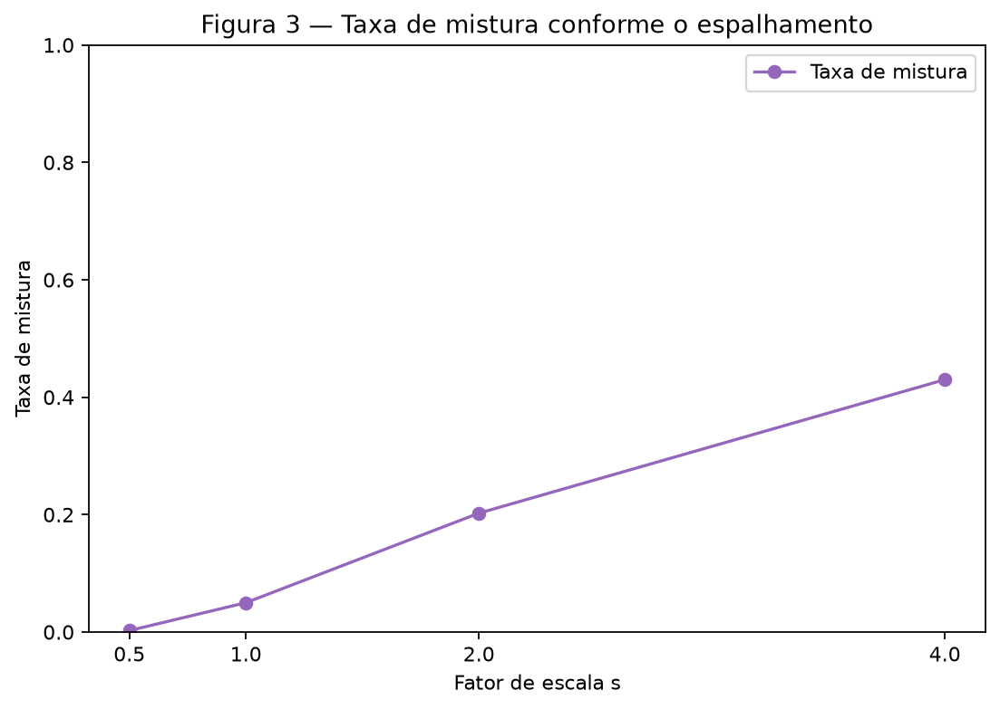
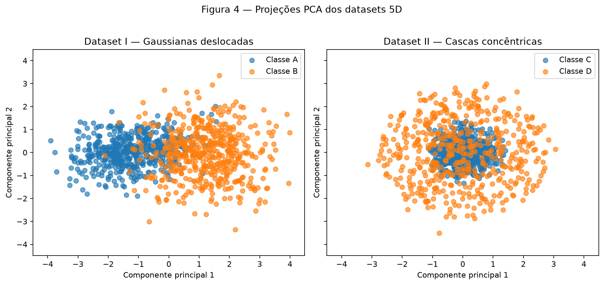
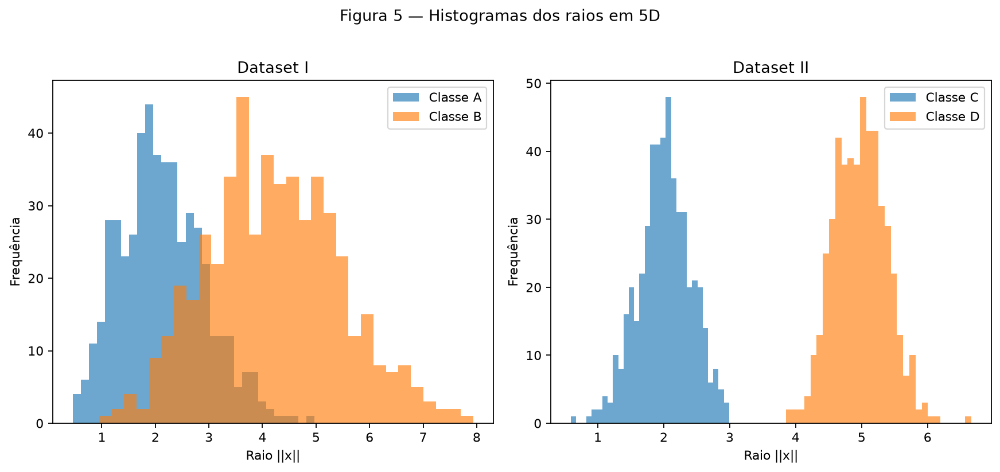
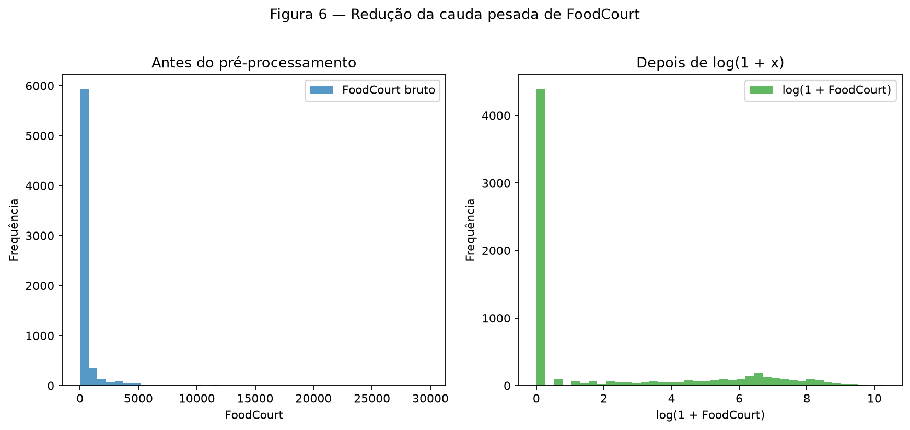

# Atividade 1 — Dados

Este relatório e suas figuras são reproduzíveis pelo script em <code>code/data_exercise.py</code>. Com o arquivo do Kaggle salvo em <code>data/spaceship-titanic/train.csv</code>, execute:

~~~bash
python3 docs/exercises/data/code/data_exercise.py
~~~

## Exercício 1

### Nuvens de pontos: geometria e espalhamento em 2D

### A — Gere as nuvens

Foram geradas quatro classes Gaussianas, com 100 pontos por classe (400 pontos no total). Uma única instância <code>rng = np.random.default_rng(42)</code> gera os ruídos. A Figura 1 usa o conjunto com <code>s = 1</code>.

{ loading=lazy }

*Figura 1 — Nuvens Gaussianas em <code>s = 1</code>, seus centros e um esboço das fronteiras por centro mais próximo. As linhas tracejadas não são fronteiras aprendidas por um classificador.*

### B — Mais ou menos espalhado

O mesmo ruído normal padronizado de cada classe foi reutilizado em <code>s = 0,5</code>, <code>1</code>, <code>2</code> e <code>4</code>; somente o espalhamento mudou. Assim, a comparação isola o efeito de <code>s</code>.

{ loading=lazy }

*Figura 2 — As quatro escalas de espalhamento com os mesmos limites nos eixos.*

As seis razões de separação, \(r_{ij}=\frac{\|\mu_i-\mu_j\|}{(\bar{\sigma_i}+\bar{\sigma_j})}\), calculadas em <code>s = 1</code>, são:

| Par | \(r_{ij}\) |
| --- | ---: |
| (0, 1) | 1,3258 |
| (0, 2) | 2,4802 |
| (0, 3) | 4,4960 |
| (1, 2) | 2,3800 |
| (1, 3) | 3,6422 |
| (2, 3) | 3,5422 |

O menor valor é \(r_{01}=1{,}3258\). Como as dispersões dobram em <code>s = 2</code>, ele se reduz à metade: \(0{,}6629\).

### C — Análise

A taxa de mistura é a fração de pontos cujo centro mais próximo pertence a outra classe; não foi treinado classificador.

| Escala \(s\) | Taxa de mistura |
| ---: | ---: |
| 0,5 | 0,25% |
| 1,0 | 5,00% |
| 2,0 | 20,25% |
| 4,0 | 43,00% |

{ loading=lazy }

*Figura 3 — A mistura aumenta de 0,25% para 43,00% quando o espalhamento cresce.*

Em <code>s = 1</code>, há mistura principalmente entre as classes 0 e 1 (5,00% no conjunto todo). Uma única reta não separa quatro classes; um conjunto de fronteiras lineares pode delimitar grande parte das nuvens, mas não zera os erros na região sobreposta. O esboço da Figura 1 usa as mediatrizes entre centros como uma aproximação visual das fronteiras que uma rede poderia aprender.

Em <code>s = 2</code>, as classes 0 e 1 já têm \(r_{01}=0{,}6629<1\), a Figura 2 mostra sobreposição visível e a mistura chega a 20,25%. A partir de <code>s = 2</code>, perde-se separabilidade linear prática: as regiões das classes passam a se sobrepor e qualquer conjunto de retas necessariamente erra pontos nessa região. Ao aumentar <code>s</code>, essa região de erro inevitável cresce, chegando a 43,00% de mistura em <code>s = 4</code>. As fronteiras da Figura 1 são somente um esboço por centro mais próximo, e não fronteiras treinadas.

## Exercício 2

### Não linearidade em dimensões mais altas

### A — Dataset I: gaussianas deslocadas

O Dataset I contém 500 amostras por classe, em 5 dimensões, geradas pelas médias e matrizes de covariância fornecidas. A distância entre os centros amostrais nos dados 5D originais (sem padronização) foi **3,3559**.

### B — Dataset II: cascas concêntricas

O Dataset II também contém 500 amostras por classe. Para cada amostra, uma direção em \(\mathbb{R}^5\) foi normalizada para norma 1 antes de receber raio normal com média 2 ou 5 e desvio 0,4. A distância entre os centros amostrais foi somente **0,2614**, como esperado para cascas concêntricas.

### C — Visualize e compare

Foi ajustado um <code>StandardScaler</code> e uma PCA independentes para cada dataset. Cada projeção tem shape <code>(1000, 2)</code>.

{ loading=lazy }

*Figura 4 — PCA dos dois conjuntos 5D; os dois painéis usam a mesma escala visual.*

| Dataset | PC1 | PC2 | PC1 + PC2 |
| --- | ---: | ---: | ---: |
| I — Gaussianas deslocadas | 50,58% | 15,69% | 66,28% |
| II — Cascas concêntricas | 21,13% | 20,55% | 41,68% |

{ loading=lazy }

*Figura 5 — Distribuições dos raios das duas classes em cada dataset.*

### D — Análise

No Dataset I, os centros estão separados por 3,3559 e a PCA conserva 66,28% da variância nas duas primeiras componentes; entre os dois, é a projeção que melhor preserva a informação visualmente relevante à classificação. No Dataset II, as classes se diferenciam pelo raio, não pelo centro: os histogramas concentram-se próximo de 2 e 5.

Uma projeção PCA misturada não prova inseparabilidade no espaço original: ela reduz cinco dimensões para duas e pode descartar informação útil. Para as cascas, um separador não linear simples é a função radial:

\[
f(x)=\sum_{i=1}^{5}x_i^2.
\]

Como os raios são aproximadamente 2 e 5, o limiar \(3{,}5^2=12{,}25\) separa as classes de forma natural: valores abaixo do limiar correspondem à casca interna e valores acima à externa. Não há um hiperplano que separe uma casca interna cercada por outra externa: um lado de qualquer hiperplano sempre contém pontos das duas cascas. Coletar mais dados não altera essa geometria radial; apenas a evidencia melhor.

## Exercício 3

### Preparação de dados reais para uma rede neural

### A — Conheça os dados

Foi usado somente <code>data/spaceship-titanic/train.csv</code>. A tarefa é prever se um passageiro foi transportado para outra dimensão durante a colisão da nave; <code>Transported=True</code> representa esse evento. O conjunto possui shape <code>(8693, 14)</code>, todas as 14 colunas oficiais, zero duplicatas exatas e alvo <code>Transported</code> presente. O alvo está balanceado: <code>False</code> representa 49,64% (4.315 linhas) e <code>True</code>, 50,36% (4.378 linhas); por isso, não foi aplicado balanceamento.

As features numéricas são <code>Age</code>, <code>RoomService</code>, <code>FoodCourt</code>, <code>ShoppingMall</code>, <code>Spa</code> e <code>VRDeck</code>; as categóricas são <code>HomePlanet</code>, <code>CryoSleep</code>, <code>Destination</code> e <code>VIP</code>. <code>PassengerId</code>, <code>Cabin</code> e <code>Name</code> foram descartadas por serem identificador, texto de alta cardinalidade ou campo não tratado nesta preparação.

| Coluna | Faltantes | Percentual |
| --- | ---: | ---: |
| PassengerId | 0 | 0,00% |
| HomePlanet | 201 | 2,31% |
| CryoSleep | 217 | 2,50% |
| Cabin | 199 | 2,29% |
| Destination | 182 | 2,09% |
| Age | 179 | 2,06% |
| VIP | 203 | 2,34% |
| RoomService | 181 | 2,08% |
| FoodCourt | 183 | 2,11% |
| ShoppingMall | 208 | 2,39% |
| Spa | 183 | 2,11% |
| VRDeck | 188 | 2,16% |
| Name | 200 | 2,30% |
| Transported | 0 | 0,00% |

As despesas são assimétricas e possuem muitos zeros; seus valores no conjunto completo são:

| Despesa | Média | Mediana | Máximo |
| --- | ---: | ---: | ---: |
| RoomService | 224,69 | 0,00 | 14.327 |
| FoodCourt | 458,08 | 0,00 | 29.813 |
| ShoppingMall | 173,73 | 0,00 | 23.492 |
| Spa | 311,14 | 0,00 | 22.408 |
| VRDeck | 304,85 | 0,00 | 24.133 |

Em todas as cinco despesas, a média é muito maior que a mediana (zero) e há máximos altos. Isso indica massa concentrada em zero e cauda longa à direita, justificando <code>log1p</code> sem excluir gastos extremos válidos.

### B — Separe antes de transformar

O split estratificado foi realizado antes de aprender qualquer transformação: 80% para treino e 20% para teste, com <code>random_state=42</code>. Isso resultou em 6.954 linhas de treino e 1.739 de teste. Em particular, no treino bruto, <code>FoodCourt</code> tem média **452,6112** e mediana **0,0000**. Imputadores, codificador e escalonador foram ajustados somente no treino para evitar *data leakage*. Se a mediana, categorias ou limites fossem calculados usando o teste, a preparação já incorporaria informação de dados que deveriam simular exemplos futuros.

### C — Pré-processe

O pipeline é simples e é aplicado na mesma ordem ao treino e ao teste:

1. Imputar mediana nas numéricas e moda nas categóricas, ajustadas no treino.
2. Criar <code>TotalSpend</code> após a imputação, somando as cinco despesas.
3. Aplicar <code>log1p</code> apenas em <code>RoomService</code>, <code>FoodCourt</code>, <code>ShoppingMall</code>, <code>Spa</code> e <code>VRDeck</code>.
4. Escalonar <code>Age</code>, as cinco despesas transformadas e <code>TotalSpend</code> para <code>[-1, 1]</code>, usando os limites do treino.
5. Aplicar one-hot nas quatro categóricas, com <code>handle_unknown="ignore"</code>; as colunas codificadas permanecem em 0/1, compatíveis com <code>tanh</code>.

A mediana é robusta à cauda longa das despesas; a moda preserva a categoria mais comum para os campos categóricos. <code>handle_unknown="ignore"</code> gera zeros em todas as colunas daquele campo se uma categoria aparecer somente no teste, sem quebrar a transformação. <code>log1p</code> comprime os valores altos e reduz a chance de a ativação <code>tanh</code> saturar. Gastos extremos válidos não foram removidos. Após o one-hot, as matrizes finais são totalmente numéricas, não têm <code>NaN</code>, têm as mesmas 17 colunas na mesma ordem e possuem shapes <code>(6954, 17)</code> e <code>(1739, 17)</code>.

### D — Verifique e visualize

{ loading=lazy }

*Figura 6 — Os mesmos valores não nulos de <code>FoodCourt</code> do treino antes e depois de <code>log1p</code>; a transformação reduz a cauda longa.*

No treino, os valores finais ficam em <code>[-1,0000, 1,0000]</code>. No teste, o máximo é **1,1383**. Isso é esperado: o <code>MinMaxScaler</code> conhece apenas os mínimos e máximos do treino; um gasto de teste acima do máximo de treino pode ultrapassar 1. Não foi feito *clipping* nem reajuste com o teste, pois ambos introduziriam uma decisão diferente da preparação definida.

A decisão com maior efeito no treinamento tende a ser a combinação de <code>log1p</code> e escalonamento das despesas. Sem ela, poucos gastos muito altos dominariam as entradas e levariam unidades <code>tanh</code> à saturação; com ela, a escala fica compatível com a ativação e as diferenças entre valores baixos continuam representadas.

## Código reproduzível

~~~python
--8<-- "docs/exercises/data/code/data_exercise.py"
~~~

## Resumo dos resultados

| # | Item | Seu valor |
| ---: | --- | --- |
| 1 | Taxa de mistura em \(s = 0{,}5\) | 0,25% |
| 2 | Taxa de mistura em \(s = 1{,}0\) | 5,00% |
| 3 | Taxa de mistura em \(s = 2{,}0\) | 20,25% |
| 4 | Taxa de mistura em \(s = 4{,}0\) | 43,00% |
| 5 | Menor \(r_{ij}\) em \(s = 1{,}0\), e o par | \(r_{01}=1{,}3258\) |
| 6 | Distância entre centros — Dataset I | 3,3559 |
| 7 | Distância entre centros — Dataset II | 0,2614 |
| 8 | Variância explicada PC1 + PC2 — Dataset I | 66,28% |
| 9 | Variância explicada PC1 + PC2 — Dataset II | 41,68% |
| 10 | Proporção da classe positiva em <code>Transported</code> | 50,36% |
| 11 | Média e mediana de <code>FoodCourt</code> no treino bruto | 452,6112 e 0,0000 |
| 12 | <code>shape</code> final da matriz de treino | <code>(6954, 17)</code> |
| 13 | Mínimo e máximo após o escalonamento | treino: -1,0000 / 1,0000; teste: -1,0000 / 1,1383 |
