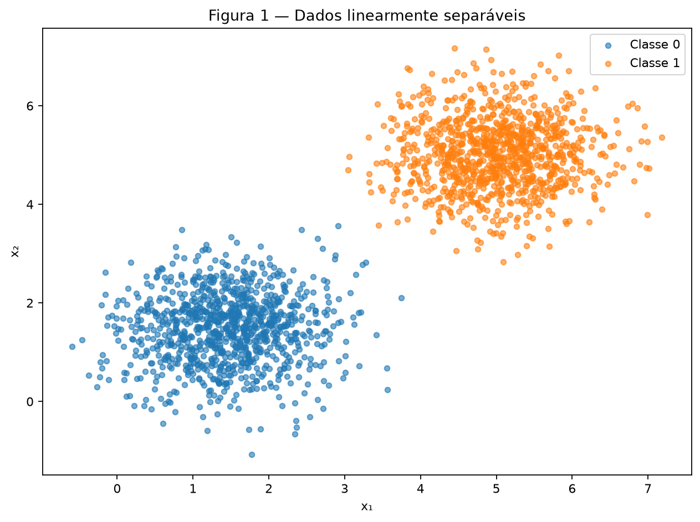
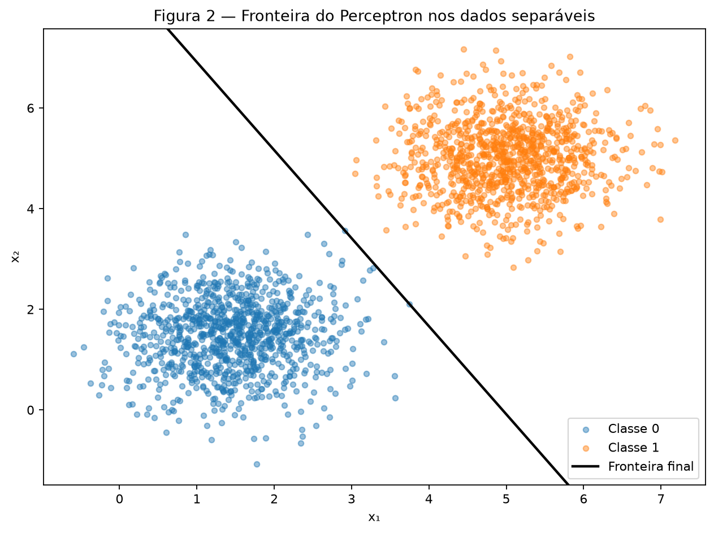
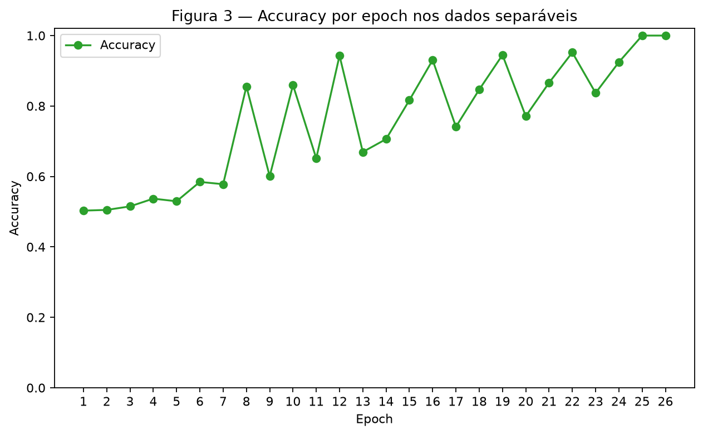
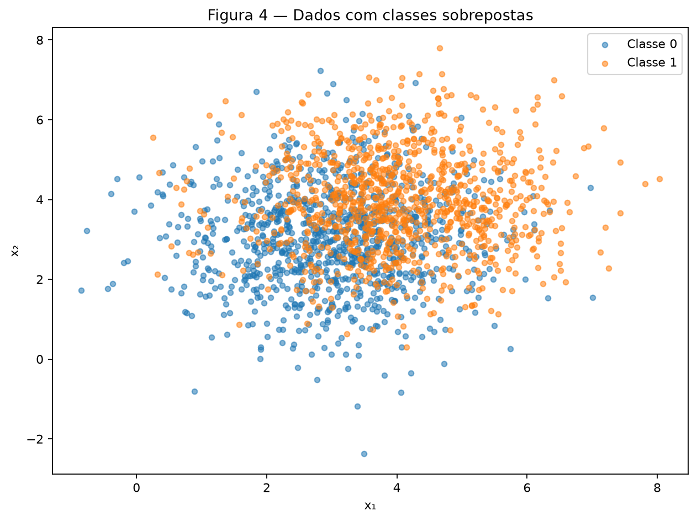
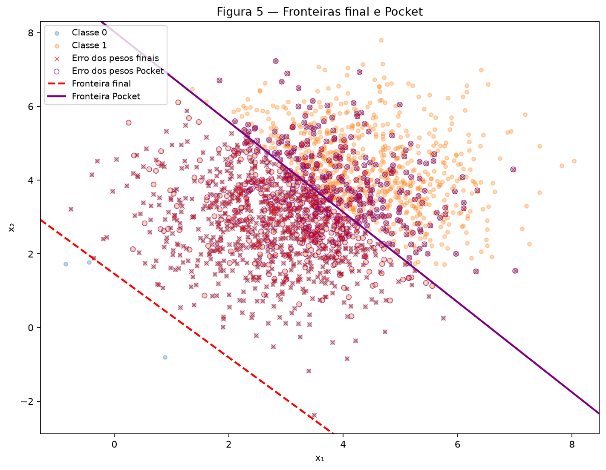
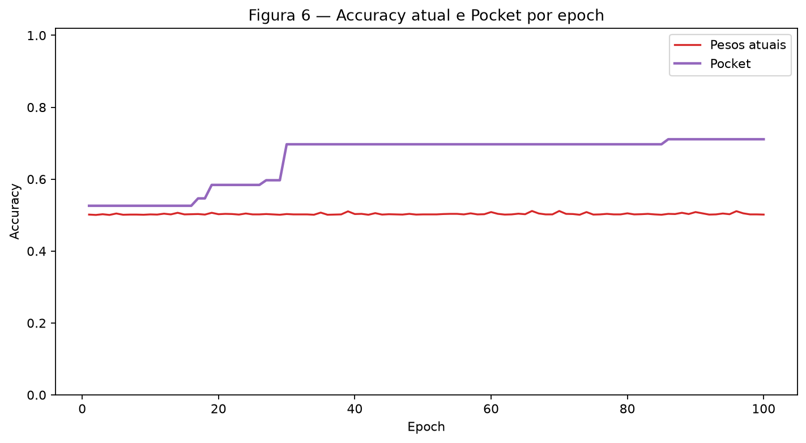

# Atividade 2 — Perceptron

Este relatório e suas seis figuras são reproduzíveis pelo script em
<code>code/perceptron.py</code>. A partir da raiz do repositório, execute:

~~~bash
python3 docs/exercises/perceptron/code/perceptron.py
~~~

Uma única instância <code>rng = np.random.default_rng(42)</code> é utilizada em
toda a execução. Os pontos não são embaralhados: em cada conjunto, os 1.000
exemplos da classe 0 são seguidos pelos 1.000 exemplos da classe 1.

## Exercise 1

### A — Generate the data

Foram gerados 1.000 pontos por classe a partir das distribuições Gaussianas
especificadas. A classe 0 tem média \([1{,}5, 1{,}5]\), a classe 1 tem média
\([5,5]\), e ambas usam a matriz de covariância
\(\begin{bmatrix}0{,}5&0\\0&0{,}5\end{bmatrix}\). O empilhamento produz
<code>X</code> com shape <code>(2000, 2)</code> e <code>y</code> com shape
<code>(2000,)</code>, contendo somente os labels 0 e 1.

{ loading=lazy }

*Figura 1 — As médias distantes em relação ao espalhamento produzem duas
nuvens visualmente separáveis por uma reta.*

### B — Implement the perceptron

A previsão usa \(\hat y=1\) quando \(w\cdot x+b\geq0\), inclusive na igualdade,
e 0 caso contrário. Para cada erro, os parâmetros são atualizados por:

\[
w \leftarrow w+\eta(y-\hat y)x,
\qquad
b \leftarrow b+\eta(y-\hat y).
\]

O treinamento percorre os exemplos explicitamente, conta as atualizações e
calcula a accuracy do conjunto completo ao final de cada epoch. A mesma função
também mantém cópias dos melhores parâmetros vistos; esses valores Pocket são
utilizados no Exercise 2. O código completo executado para os dois exercícios é:

~~~python
--8<-- "docs/exercises/perceptron/code/perceptron.py"
~~~

### C — Train and measure

Os pesos foram inicializados em **[0,002532, 0,008952]**, sorteados por
<code>rng.normal(0, 0.01, size=2)</code>, e o bias foi inicializado em zero. Com
\(\eta=0{,}01\), o treinamento produziu:

- pesos finais \(w=[0{,}050497,\ 0{,}028872]\);
- bias final \(b=-0{,}250000\);
- **26 epochs** até a parada;
- accuracy final de **100,00%**.

{ loading=lazy }

*Figura 2 — A fronteira final separa os 2.000 pontos. Como a accuracy é 100%,
não há pontos classificados incorretamente para marcar.*

{ loading=lazy }

*Figura 3 — Accuracy medida no conjunto completo após cada epoch.*

### D — Analysis

**1. Convergência nos dados separáveis.** A regra só altera os parâmetros em
uma classificação incorreta. Neste treinamento, as quantidades de atualizações
por epoch foram
<code>[3, 3, 4, 4, 3, 4, 3, 4, 2, 4, 2, 4, 2, 3, 3, 3, 2, 3, 3, 2, 3, 3, 2, 3, 1, 0]</code>.
Elas não precisam cair a cada passagem, pois uma correção pode desfazer parte
de outra, mas a tendência é haver menos erros. Na epoch 26, todos os exemplos
já estavam do lado correto da reta e nenhuma atualização foi necessária.

**2. Comparação dos learning rates.** A comparação foi controlada: os dois
treinamentos partiram dos mesmos pesos **[0,002532, 0,008952]** e mudaram apenas
\(\eta\).

| \(\eta\) | Epochs | Accuracy final | \(w/\lVert w\rVert\) |
| ---: | ---: | ---: | --- |
| 0,01 | 26 | 100,00% | [0,868123, 0,496349] |
| 1,0 | 37 | 100,00% | [0,867950, 0,496652] |

Com \(\eta=1{,}0\), os parâmetros finais foram
\(w=[5{,}870616,\ 3{,}359239]\) e \(b=-31{,}000000\). Os dois vetores têm
direções normalizadas muito próximas neste experimento, mas os parâmetros não
são simples múltiplos entre si e as fronteiras não são idênticas. Como os pesos
iniciais têm magnitude próxima de 0,01, uma atualização com \(\eta=1\) torna a
inicialização quase desprezível, enquanto com \(\eta=0{,}01\) ela tem influência
relativa maior. Isso altera a trajetória e levou a 37 epochs, em vez de 26.

**3. Inicialização em zero.** Se \(w_0=0\) e \(b_0=0\), depois de qualquer
sequência de atualizações os parâmetros podem ser escritos como:

\[
w_{\eta}=\eta\sum_t e_t x_t,
\qquad
b_{\eta}=\eta\sum_t e_t,
\]

onde \(e_t=y_t-\hat y_t\). Para duas taxas positivas \(\eta_1\) e \(\eta_2\),
supondo a mesma sequência até um passo, temos:

\[
(w_{\eta_2},b_{\eta_2})=
\frac{\eta_2}{\eta_1}(w_{\eta_1},b_{\eta_1}).
\]

O score do segundo treinamento é o score do primeiro multiplicado pelo fator
positivo \(\eta_2/\eta_1\). Seu sinal não muda; portanto, ambos fazem as mesmas
previsões, encontram os mesmos erros e preservam a relação no passo seguinte.
Por indução, a fronteira e o número de epochs são iguais. A inicialização não
nula exigida no item B é o que permite que \(\eta\) tenha efeito além de uma
simples mudança de escala.

## Exercise 2

### A — Generate the data

A mesma função de geração foi reutilizada, mudando apenas os parâmetros. A
classe 0 tem média \([3,3]\), a classe 1 tem média \([4,4]\), e ambas usam
covariância \(\begin{bmatrix}1{,}5&0\\0&1{,}5\end{bmatrix}\). Novamente foram
gerados 1.000 pontos de cada classe, formando <code>X</code> com shape
<code>(2000, 2)</code> e <code>y</code> com shape <code>(2000,)</code>.

{ loading=lazy }

*Figura 4 — A proximidade das médias e o espalhamento maior causam forte
sobreposição, de modo que nenhuma reta separa perfeitamente as classes.*

### B — Train, keeping the best weights

Foi reutilizada a mesma função de treinamento, com \(\eta=0{,}01\) e limite de
100 epochs. Os pesos iniciais, obtidos da mesma sequência do <code>rng</code>,
foram **[0,012158, -0,004510]**, com bias zero.

Os **pesos finais** são o estado que permaneceu após a última atualização da
epoch 100:

- \(w_{final}=[0{,}054484,\ 0{,}048043]\);
- \(b_{final}=-0{,}070000\);
- accuracy final de **50,15%**.

Os **pesos Pocket** são cópias dos parâmetros que produziram a maior accuracy
observada após uma atualização:

- \(w_{pocket}=[0{,}010664,\ 0{,}008727]\);
- \(b_{pocket}=-0{,}070000\);
- accuracy Pocket de **71,10%**;
- melhor estado encontrado na **epoch 86**.

O uso de <code>w.copy()</code> é essencial: uma simples atribuição manteria uma
referência ao array atual, e atualizações posteriores também alterariam o que
deveria ter sido guardado no Pocket.

### C — Figures

{ loading=lazy }

*Figura 5 — A linha tracejada vermelha é a fronteira final e a linha roxa é a
fronteira Pocket. Cruzes vermelhas marcam erros dos pesos finais; círculos
roxos vazados marcam erros do Pocket. Um ponto pode receber os dois símbolos.*

{ loading=lazy }

*Figura 6 — A accuracy atual oscila, enquanto a melhor accuracy acumulada do
Pocket nunca diminui.*

### D — Analysis

**1. Diferença entre os pesos finais e Pocket.** A fronteira final é

\[
0{,}054484x_1+0{,}048043x_2-0{,}070000=0,
\]

que passa muito abaixo do centro das duas nuvens e classifica quase todos os
pontos como classe 1. Por isso sua accuracy é **50,15%**, próxima de uma escolha
por acaso em classes balanceadas. Em cada erro, o bias muda somente
\(\eta=0{,}01\), enquanto cada componente de \(w\) muda por \(0{,}01x_j\).
Como as coordenadas têm valores típicos próximos de 3 ou 4 e
\(\lVert x\rVert\) fica aproximadamente em torno de 5, a alteração de \(w\)
tem efeito maior que a de \(b\). Com os exemplos ordenados por classe, as
últimas correções podem empurrar a fronteira para uma posição ruim.

A fronteira Pocket,

\[
0{,}010664x_1+0{,}008727x_2-0{,}070000=0,
\]

passa pela região entre as nuvens e atinge **71,10%**, próxima da melhor
accuracy esperada para uma reta neste conjunto. O Pocket não impede que os
pesos atuais piorem; ele apenas preserva a melhor posição já encontrada.

**2. Teorema de convergência.** Na Figure 3, a accuracy se estabiliza e a
quantidade de atualizações chega a zero. Na Figure 6, os pesos atuais continuam
oscilando durante as 100 epochs. O Perceptron Convergence Theorem garante que o
algoritmo encontra uma solução em um número finito de atualizações quando os
dados são linearmente separáveis. O Exercise 2 viola exatamente essa hipótese:
há pontos das duas classes na mesma região, então toda reta deixa exemplos do
lado incorreto. Sempre resta algum erro capaz de provocar outra atualização.

**3. Mais epochs e menor learning rate.** Acrescentar epochs apenas prolonga a
sequência de correções incompatíveis: corrigir um ponto pode voltar a errar
outro, pois não existe uma reta perfeita. Diminuir \(\eta\) reduz o tamanho de
cada passo e pode mudar a trajetória quando a inicialização é não nula, mas não
muda a geometria dos dados nem cria uma fronteira separadora. Assim, nenhuma
das duas mudanças garante convergência. O Pocket é útil porque mantém a melhor
fronteira observada, mesmo sem eliminar a limitação do modelo linear.

## Results summary

| # | Quantity | Value |
| ---: | --- | --- |
| 1 | Exercise 1 — final \(w\) and \(b\) | \(w=[0{,}050497,\ 0{,}028872]\), \(b=-0{,}250000\) |
| 2 | Exercise 1 — epochs to convergence | 26 |
| 3 | Exercise 1 — final accuracy | 100,00% |
| 4 | Exercise 1 — epochs and final accuracy with \(\eta=1{,}0\) | 37 epochs; 100,00% |
| 5 | Exercise 2 — final \(w\) and \(b\) | \(w=[0{,}054484,\ 0{,}048043]\), \(b=-0{,}070000\) |
| 6 | Exercise 2 — accuracy of the final weights | 50,15% |
| 7 | Exercise 2 — accuracy of the pocket weights | 71,10% |
| 8 | Exercise 2 — epoch at which the pocket best occurred | 86 |
